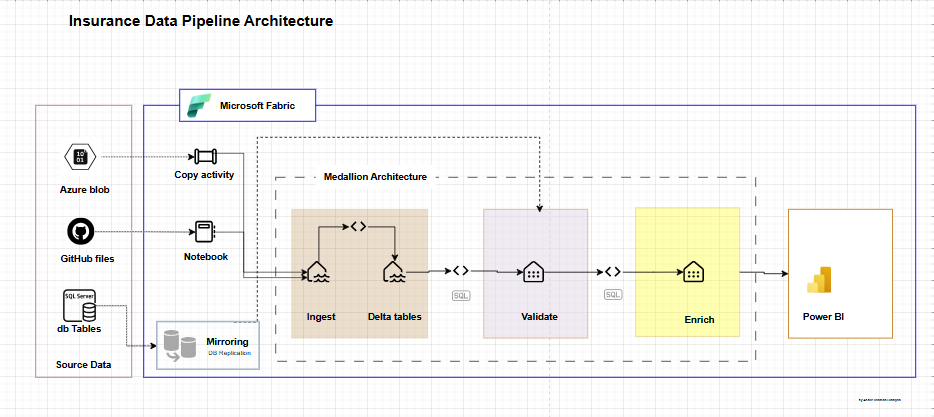
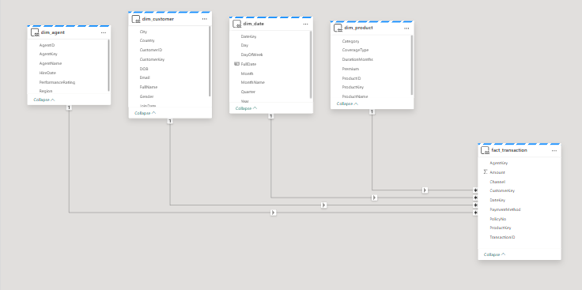
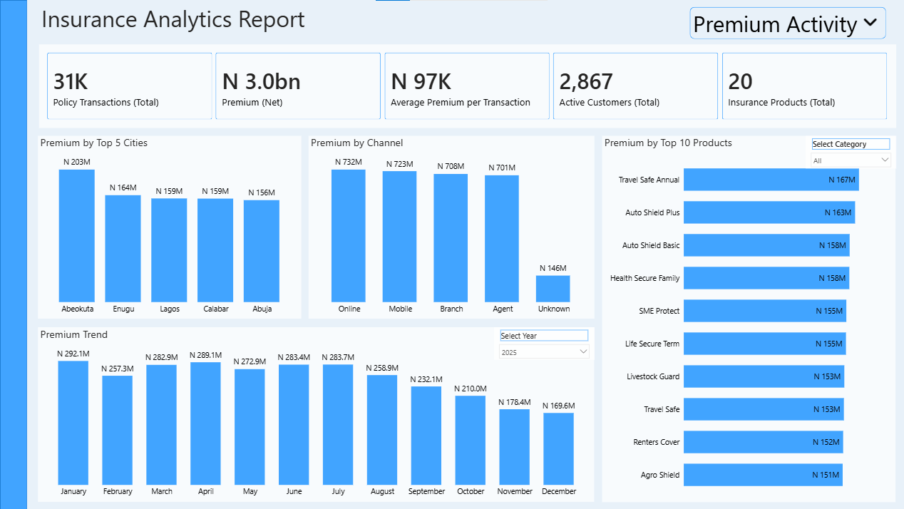
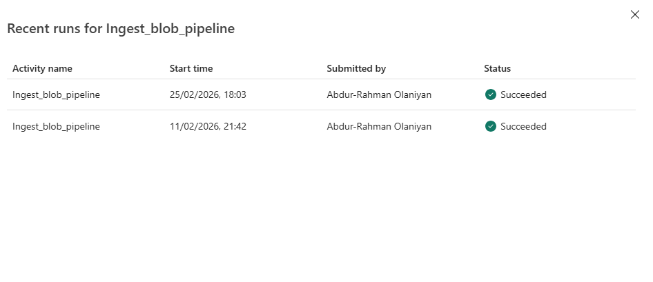
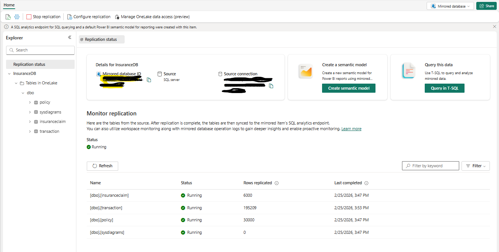
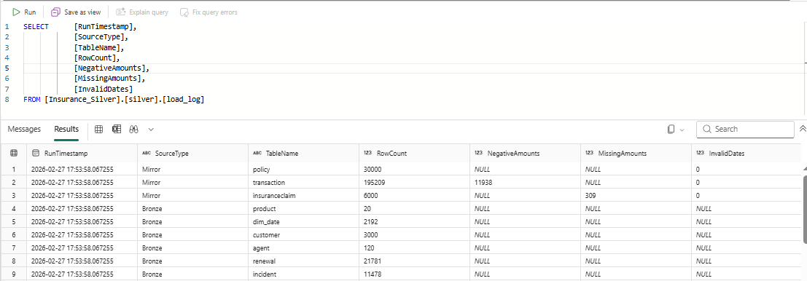
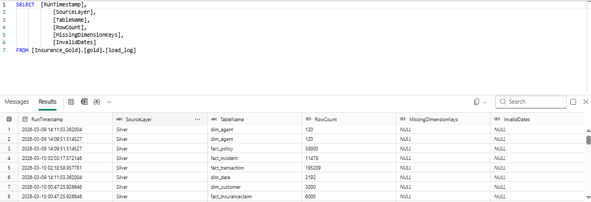
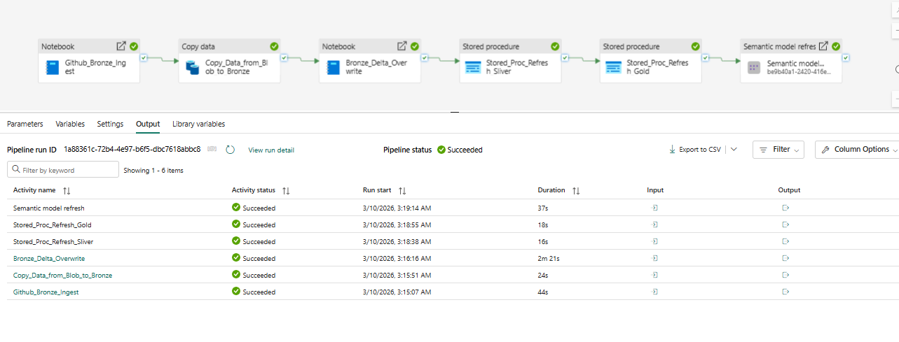
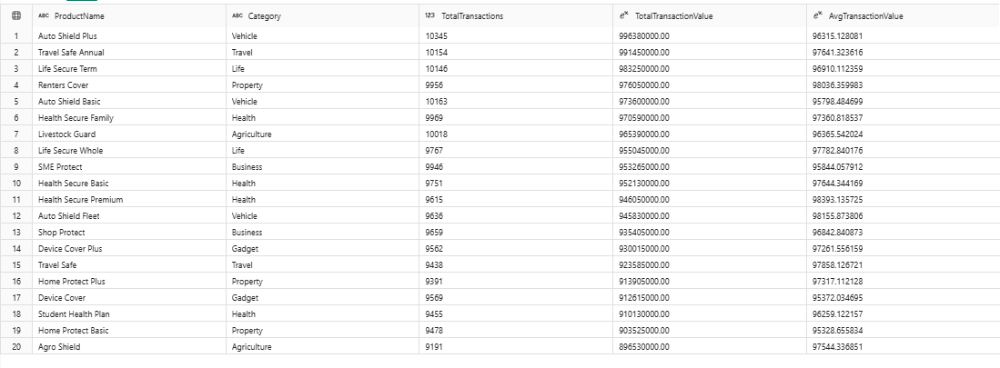
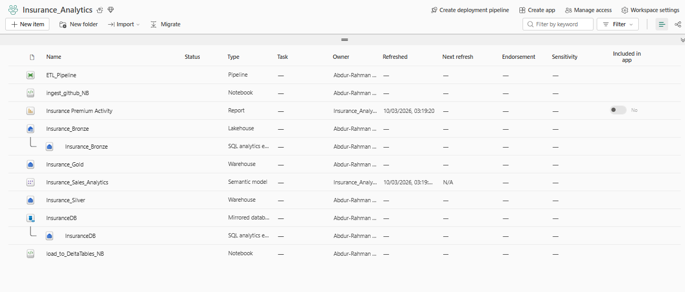

# Insurance Data Analytics Pipeline with Microsoft Fabric

An end-to-end insurance analytics project built in **Microsoft Fabric** to ingest data from **GitHub**, **Azure Blob Storage**, and replicate **SQL Server database** tables , consolidate it into a unified **OneLake** store, transform it through a **Medallion Architecture (Bronze - Silver - Gold)**, and deliver business insights in **Power BI**.



## Table of Contents

* [Project Overview](#project-overview)
* [Business Problem / Use Case](#business-problem--use-case)
* [Solution Overview](#solution-overview)
* [Architecture](#architecture)
* [Data Sources](#data-sources)
* [Medallion Layers](#medallion-layers)

  * [Bronze Layer – Ingest](#bronze-layer--ingest)
  * [Silver Layer – Validate](#silver-layer--validate)
  * [Gold Layer – Enrich](#gold-layer--enrich)
* [Power BI Reporting](#power-bi-reporting)
* [Repository Structure](#repository-structure)
* [Reproducibility / Setup Guide](#reproducibility--setup-guide)

  * [Prerequisites](#prerequisites)
  * [1. Clone the Repository](#1-clone-the-repository)
  * [2. Prepare the Source Data](#2-prepare-the-source-data)
  * [3. Create the Fabric Workspace Items](#3-create-the-fabric-workspace-items)
  * [4. Configure Bronze Ingestion](#4-configure-bronze-ingestion)
  * [5. Load Bronze Files into Delta Tables](#5-load-bronze-files-into-delta-tables)
  * [6. Configure SQL Server Mirroring](#6-configure-sql-server-mirroring)
  * [7. Build the Silver Layer](#7-build-the-silver-layer)
  * [8. Build the Gold Layer](#8-build-the-gold-layer)
  * [9. Build the Semantic Model and Power BI Report](#9-build-the-semantic-model-and-power-bi-report)
  * [10. Orchestrate the End-to-End Pipeline](#10-orchestrate-the-end-to-end-pipeline)
* [Recommended Run Order](#recommended-run-order)
* [Example Business Questions Answered](#example-business-questions-answered)
* [Key Design Decisions](#key-design-decisions)
* [Project Outputs](#project-outputs)
* [Future Improvements](#future-improvements)

## Project Overview

This project demonstrates how to build a **modern insurance analytics platform** in Microsoft Fabric using multiple ingestion patterns for different source systems.

The pipeline ingests:

* CSV files from **GitHub** using a **Fabric Notebook**
* CSV files from **Azure Blob Storage** using **Data Factory Copy Activity**
* Relational tables from **SQL Server** using **Fabric Data Mirroring**

The ingested data is centralized in Fabric OneLake and processed through a layered architecture:

* **Bronze** for raw landing and Delta staging
* **Silver** for validation, cleaning, and type standardization
* **Gold** for dimensional modeling and analytics-ready fact tables

The final curated semantic model supports **Power BI dashboards** for insurance premium activity, policy activity, renewals, claims, and operational analysis.

## Business Problem / Use Case

An insurance company stores operational data across **multiple disconnected platforms**:

* files on **GitHub**
* files in **Azure Blob Storage**
* transactional tables in **SQL Server**

Because these sources are separated, analysts cannot easily combine them into a single trusted dataset for reporting and business analysis. This creates manual data preparation work, inconsistent reporting, and slow decision-making.

This project solves that problem by using **Microsoft Fabric** to ingest, centralize, validate, and model data from all three source systems into a **unified analytics environment** that supports business intelligence and self-service reporting.

## Solution Overview

The solution uses the following Microsoft Fabric components:

* **Lakehouse** to store raw files and Delta staging tables
* **Notebook** to ingest GitHub-hosted CSV files
* **Data Factory pipeline / Copy Activity** to ingest Azure Blob files
* **Data Mirroring** to replicate SQL Server source tables
* **Data Warehouse** to host Silver and Gold SQL transformations
* **Stored Procedures** to standardize and refresh curated tables
* **Power BI (Semantic Model & Analytics Report)** to analyse and visualize the final analytics model

## Architecture

The architecture follows a **Medallion pattern**:

1. **Ingest**

   * GitHub CSVs are pulled into the Lakehouse using a Fabric notebook.
   * Azure Blob CSVs are copied into the Lakehouse using Copy Activity.
   * SQL Server tables are mirrored into Fabric using Data Mirroring.

2. **Validate**

   * Raw Bronze data is standardized in the Silver layer using T-SQL stored procedures.
   * Columns are trimmed, empty strings are converted to nulls, strings columns are converted to dates and numerics types, and basic quality checks are logged.

3. **Enrich**

   * Silver tables are transformed into Gold dimension and fact tables.
   * Business-ready entities are created for reporting, including customer, agent, product, policy, transaction, incident, renewal, and claims analytics.

4. **Report**

   * Gold tables are published through a semantic model and consumed in Power BI dashboards.

## Data Sources

This project uses three distinct source domains:

### 1) GitHub CSV Files

Used for relatively static reference or master-style data.

Example entities:

* agent
* customer
* date
* product

### 2) Azure Blob Storage CSV Files

Used for file-based operational data landed in cloud storage.

Example entities:

* incident
* renewal

### 3) SQL Server Database Tables

Used for transactional source data mirrored into Fabric.

Example entities:

* policy
* insuranceclaim
* transaction

## Medallion Layers

### Bronze Layer – Ingest

The Bronze layer is the raw landing zone.

Responsibilities:

* ingest source data as-is without transformation
* preserve original columns as strings where appropriate
* add ingestion metadata such as source file and ingest timestamp
* create initial staging Delta tables in the Lakehouse

Key patterns used:

* **Notebook ingestion** for GitHub files
* **Copy Activity** for Azure Blob files
* **Mirror replication** for SQL Server tables

Expected Bronze outputs:

* raw files in Lakehouse folders
* Delta staging tables such as:

  * `stg_agent`
  * `stg_customer`
  * `stg_date`
  * `stg_product`
  * `stg_incident`
  * `stg_renewal`


Insurance_DB replicated through sqlserver data mirroring

 * `transaction`
 * `policy`
 * `insuranceclaim`

### Silver Layer – Validate

The Silver layer applies cleaning, typing, and validation logic.

Responsibilities:

* trim whitespace
* convert blank strings to nulls
* cast dates, numerics, and keys to appropriate data types
* standardize naming and data quality logic
* load relational tables in the warehouse
* log row counts and simple anomaly checks

Silver outputs:

* `silver.agent`
* `silver.customer`
* `silver.dim_date`
* `silver.product`
* `silver.incident`
* `silver.renewal`
* `silver.policy`
* `silver.insuranceclaim`
* `silver.transaction`
* `silver.load_log`

### Gold Layer – Enrich

The Gold layer creates business-ready dimensional and fact tables.

Responsibilities:

* generate surrogate keys for dimensions
* join related entities across Silver tables
* handle analytic defaults such as unknown channels or policy status derivation
* create star-schema style tables for reporting
* log row counts after refresh

Gold outputs:

* Dimensions

  * `gold.dim_customer`
  * `gold.dim_agent`
  * `gold.dim_product`
  * `gold.dim_date`
* Facts

  * `gold.fact_policy`
  * `gold.fact_transaction`
  * `gold.fact_insuranceclaim`
  * `gold.fact_incident`
  * `gold.fact_renewal`
* Logging

  * `gold.load_log`

## Power BI Reporting

The final Gold model is consumed in Power BI through a curated semantic model.



Possible reporting areas include:
- premium volume by product and customer segment
- transaction and premium trends by month and year
- premium distribution across top cities and regions
- channel‑level premium contribution (online, mobile, branch, agent)
- product‑level premium performance and ranking
- customer activity and active customer growth
- average premium per transaction analysis
- premium share by insurance product category
- operational insights from policy transaction counts




## Repository Structure

```text
Insurance-Data-Analytics-Pipeline-with-Microsoft-Fabric/
│
├── Architecture Diagram.png
├── ETL_Pipeline.png
├── README.md
│
├── Bronze_Layer_Ingest/
│   ├── Notebooks/
│   │   ├── ingest_github_NB.ipynb
│   │   └── load_to_DeltaTables_NB.ipynb
│   ├── copy_blob_to_lkh.png
│   ├── ingest_github_NB.py
│   └── load_to_DeltaTables_NB.py
│
├── Data/
│   ├── BLOBData/
│   │   ├── incident.csv
│   │   └── renewal.csv
│   ├── GitHubData/
│   │   ├── agent.csv
│   │   ├── customer.csv
│   │   ├── date.csv
│   │   └── product.csv
│   └── SQLDB/
│       ├── insuranceclaim.csv
│       ├── policy.csv
│       └── transaction.csv
│
├── Mirrored_DB/
│   └── SqlServer_Replication_Status.png
│
├── Silver_Layer_Validate/
│   ├── log_anomaly_check.png
│   ├── test_stored_proc.sql
│   ├── usp_load_silver.sql
│   └── usp_load_silver_from_mirror.sql
│
├── Gold_Layer_Enrich/
│   ├── ddl_gold.sql
│   ├── log_anomaly_check.png
│   ├── usp_gold_refresh.sql
│   └── usp_load_gold.sql
│
└── PowerBI/
    ├── PowerBI Dashboard.png
    └── Semantic_Model.png
```

## Reproducibility / Setup Guide

This section explains how to reproduce the project in a new Microsoft Fabric environment.

> **Important:** Some connection details, workspace names, credentials, and database endpoints are environment-specific. Replace placeholders with your own values during setup.

### Prerequisites

Before reproducing this project, make sure you have:

* a **Microsoft Fabric-enabled workspace**. Click [HERE](https://learn.microsoft.com/en-us/fabric/fundamentals/free-trial-account-personal-email) to learn how to create Microsoft Fabric Free Trail account
* permission to create a **Lakehouse**, **Warehouse**, **Pipeline**, and **Notebook**
* access to an **Azure Blob Storage** account/container
* access to a **SQL Server** database that can be mirrored into Fabric. (Not SQL Express Server)
* Power BI access in the same Fabric tenant
* the source CSV files used in this repository

### 1. Clone the Repository

Clone or download this repository locally so you can reuse the notebooks, SQL scripts, screenshots, and sample data.

```bash
git clone https://github.com/AbdurRahman-Olaniyan/Insurance-Data-Analytics-Pipeline-with-Microsoft-Fabric.git
cd Insurance-Data-Analytics-Pipeline-with-Microsoft-Fabric
```

### 2. Prepare the Source Data

Set up the three input sources.

#### GitHub source

Create or reuse a GitHub repository that contains the CSV files for:

* `agent.csv`
* `customer.csv`
* `date.csv`
* `product.csv`

#### Azure Blob source

Upload the following files into your Azure Blob container:

* `incident.csv`
* `renewal.csv`

#### SQL Server source

Prepare the SQL Server database tables:

* `policy`
* `insuranceclaim`
* `transaction`

### 3. Create the Fabric Workspace Items

Inside Microsoft Fabric, create:

* **one Lakehouse** for raw landing and Delta staging
* **two Warehouse** for Silver and Gold transformations
* **one Data Pipeline** for orchestration
* **two Notebooks** for GitHub ingestion and Delta loading
* **one Mirrored Database connection** for SQL Server replication

A simple naming convention could be:

* Lakehouse: `Insurance_Bronze`
* Warehouse: `Insurance_Silver` `Insurance_Gold`
* Scemas: `bronze` `silver` `gold`
* Mirrored DB: takes the name of your sql server db, `InsuranceDB`

### 4. Configure Bronze Ingestion

#### 4.1 GitHub ingestion notebook

Import or recreate the notebook logic from:

* `Bronze_Layer_Ingest/ingest_github_NB.py`
* `Bronze_Layer_Ingest/Notebooks/ingest_github_NB.ipynb`

Update the GitHub variables as needed:

* `OWNER`
* `REPO`
* `BRANCH`
* `FOLDER_PATH`
* destination Bronze directory (use relative path) in the Lakehouse

Run the notebook so the GitHub CSV files are copied into a Lakehouse path similar to:

* `Files/bronze/github/`

#### 4.2 Azure Blob Copy Activity

Create a Fabric Data Factory pipeline with:

* source connection to Azure Blob Storage
* sink connection to the Lakehouse file area

Copy the Blob files into a Lakehouse path similar to:

* `Files/bronze/azureblob/`

You can use the screenshot below as documentation of the Blob-to-Lakehouse copy step:



### 5. Load Bronze Files into Delta Tables

Import or recreate the logic from:

* `Bronze_Layer_Ingest/load_to_DeltaTables_NB.py`
* `Bronze_Layer_Ingest/Notebooks/load_to_DeltaTables_NB.ipynb`

This notebook reads the raw CSV files from Bronze file folders, applies explicit string-based schemas, appends ingestion metadata, and writes Delta staging tables.

Expected staging outputs include:

* `stg_incident`
* `stg_renewal`
* `stg_agent`
* `stg_customer`
* `stg_date`
* `stg_product`

### 6. Configure SQL Server Mirroring

Set up Fabric **Data Mirroring** to replicate your SQL Server source tables into Fabric.

Steps: [Configure Microsoft Fabric Mirroring from SQL Server](https://learn.microsoft.com/en-us/fabric/mirroring/sql-server-tutorial?tabs=sql201622)
1. Create a mirrored database connection to the SQL Server source.
2. Select the required source tables.
3. Start replication.
4. Confirm table sync status before downstream transformations.


Target mirrored tables should include:

* `policy`
* `insuranceclaim`
* `transaction`

Verify the replication status as shown below:



### 7. Build the Silver Layer

Use the SQL scripts in `Silver_Layer_Validate/` to create standardized Silver tables.

#### 7.1 Create or use a Silver schema

Create a schema such as `silver` inside the Fabric Warehouse.

#### 7.2 Run Bronze-to-Silver transformation procedure

Execute:

* `usp_load_silver.sql`

This script standardizes the Bronze Delta staging tables and creates cleaned Silver tables.

#### 7.3 Run Mirror-to-Silver transformation procedure

Execute:

* `usp_load_silver_from_mirror.sql`

This script standardizes the mirrored SQL Server tables into Silver warehouse tables.

#### 7.4 Add refresh and logging procedure

Execute:

* `test_stored_proc.sql`

This wrapper refreshes the Silver layer and logs row counts plus selected anomaly checks into `silver.load_log`.

Suggested validation checks:

* row counts after each load
* null or missing amount checks
* invalid date checks
* negative transaction amount checks
* policy date consistency checks

Verify the anomaly/log output as shown below:



### 8. Build the Gold Layer

Use the SQL scripts in `Gold_Layer_Enrich/` to create the reporting model.

#### 8.1 Create Gold schema and tables

Run:

* `ddl_gold.sql`

This script creates dimension tables, fact tables, and a load log table.

#### 8.2 Load Gold tables

Run:

* `usp_load_gold.sql`

This script populates dimensions and facts from the Silver layer.

#### 8.3 Add refresh and logging procedure

Run:

* `usp_gold_refresh.sql`

This procedure refreshes the Gold layer and logs row counts for major tables.

Verify the Gold validation output as shown below:



### 9. Build the Semantic Model and Power BI Report

Create a semantic model in Power BI or Fabric using the Gold layer tables.

Recommended tables to publish: (you may add one fact table to a curated semantic model)

* `gold.dim_customer`
* `gold.dim_agent`
* `gold.dim_product`
* `gold.dim_date`
* `gold.fact_policy`
* `gold.fact_transaction`
* `gold.fact_insuranceclaim`
* `gold.fact_incident`
* `gold.fact_renewal`

Suggested basic model relationships:

* fact tables join to the corresponding dimension surrogate keys
* date relationships use date keys and make dim_date as date
* policy-based facts can also support drill-through analysis

### 10. Orchestrate the End-to-End Pipeline

In Fabric Data Factory, build a pipeline that executes the solution in sequence:

1. GitHub notebook ingestion
2. Azure Blob copy activity
3. Bronze Delta notebook
4. Silver refresh stored procedure
5. Gold refresh stored procedure
6. Semantic model / report refresh

You can add retries, failure notifications, and row-count checks for more production-ready orchestration.

## Recommended Run Order

For a clean end-to-end refresh, use this sequence:

1. Ingest GitHub CSVs to Bronze files
2. Copy Azure Blob files to Bronze files
3. Run the Bronze Delta notebook
4. Execute `silver.usp_refresh_silver`
5. Execute `gold.usp_refresh_gold`
6. Refresh the semantic model / Power BI report



## Example Business Questions Answered

This model can support questions such as:

* Which insurance products generate the highest transaction value?
```sql
SELECT
    dp.ProductName,
    dp.Category,
    COUNT(ft.TransactionID) AS TotalTransactions,
    SUM(ft.Amount) AS TotalTransactionValue,
    AVG(ft.Amount) AS AvgTransactionValue
FROM [gold].[fact_transaction] ft
LEFT JOIN [gold].[dim_product] dp
    ON dp.ProductKey = ft.ProductKey
GROUP BY
    dp.ProductName,
    dp.Category
ORDER BY
    TotalTransactionValue DESC;

```
### Query result



## Key Design Decisions

* **Multiple ingestion patterns** were used because each source system had a different access method.
* **Bronze files and Delta staging** preserve raw lineage before warehouse transformations.
* **Silver stored procedures** centralize cleaning and validation logic in SQL.
* **Gold dimensions and facts** simplify reporting and semantic modeling.
* **Load logs** provide basic observability for refresh tracking and anomaly review.

## Project Outputs

This repository includes:

* ingestion notebooks and Python exports
* SQL scripts for Silver and Gold layers
* architecture and pipeline screenshots
* Power BI semantic model and dashboard screenshots
* sample source data organization by source system

## Microsoft Fabric Workspace Outputs



## Future Improvements

Potential next enhancements include:

* add Mirror sync validation checkpoint to pipeline orchestration
* parameterizing notebook paths and environment names
* adding incremental load patterns instead of full refreshes
* introducing data quality rules with pass/fail thresholds
* adding surrogate key generation strategies more suitable for production scale
* adding CI/CD deployment for Fabric artifacts
